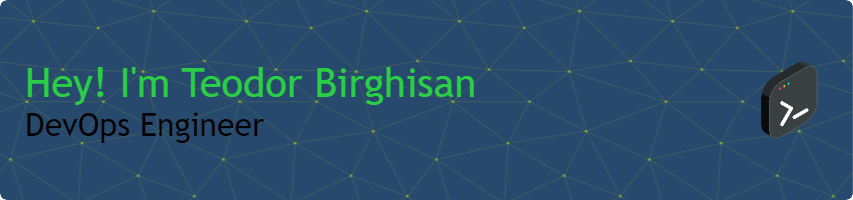

  

  
  
  

  

##  About Me

I'm a **DevOps Engineer** driven by a passion for **Azure**, **Terraform**, **Kubernetes**, **Pipelines**, **Docker**, and developing **automation scripts**.
I specialize in creating scalable cloud infrastructure, enabling seamless automation, and developing robust CI/CD pipelines to accelerate software delivery.

- 🌐 I'm currently working on **understanding all the depths of DevOps tools and best practices**

- 🎯 **Join me** as I share my journey, insights, and lessons learned in mastering the DevOps landscape.

- 💡 Together, we can create efficient, scalable, and automated solutions!

<h2>
   Tech Stack
</h2>

<h2>
  GitHub Stats
</h2>

   
   
  

  <h2>
    
    Contact Me
  </h2>
  
<i>You can reach out to me via:</i>

  
  

  

  
  

