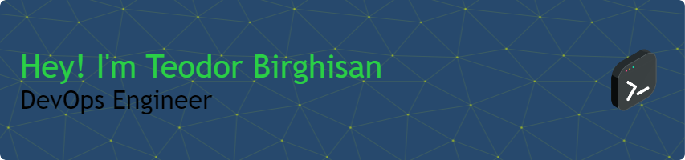

  

  <h3>Cloud &amp; DevOps Engineer — building scalable, automated infrastructure on Azure</h3>

  
  
  
  

## 👋 About Me

I'm a **DevOps / Cloud Engineer** focused on **Azure**, **Terraform**, and **Kubernetes**. I build scalable cloud infrastructure and CI/CD pipelines that make software delivery fast, repeatable, and boring — in the best possible way.

- ☁️ I turn manual, error-prone processes into automated, version-controlled infrastructure.
- 💻 I also build the software that runs on it — services and full-stack apps in Go, Python, C#, and TypeScript.
- 🏠 Off the clock, I run a self-hosted homelab where I break things on purpose to learn how they really work.
- 📚 Currently going deep on DevOps best practices, IaC, and platform engineering.

## 🛠️ Tech Stack

**Cloud & IaC**

**Containers & Orchestration**

**CI/CD**

**Languages**

**Frameworks & Runtimes**

**Homelab & Networking**

## 🏠 Homelab

My homelab is where the DevOps theory meets real hardware — a personal platform for running things properly.

- 🐳 **Self-hosted services** running as Docker containers, deployed and reverse-proxied like production.
- ☸️ **A home Kubernetes cluster** for practising orchestration, GitOps, and everything that breaks along the way.
- 🔒 **Tailscale** for secure, zero-config access to everything, wherever I am.
- 📈 **Monitoring & alerting** so the lab tells me when something's wrong before I find out the hard way.

## 📈 GitHub Stats

  

  

## 📊 GitHub Metrics

  

Auto-generated daily by a GitHub Action — see <a href="./.github/workflows/metrics.yml"><code>.github/workflows/metrics.yml</code></a>.
